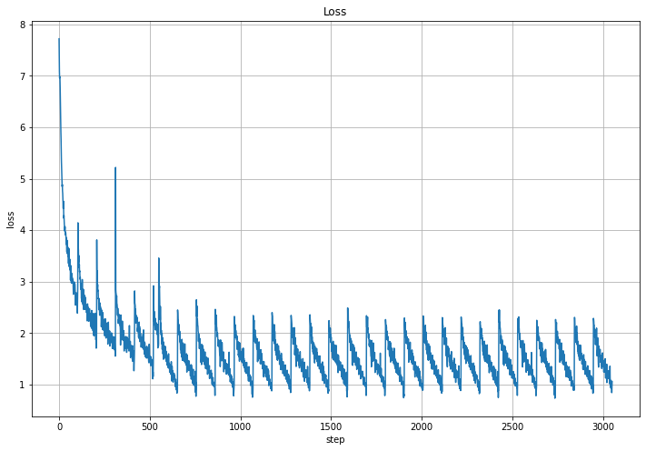
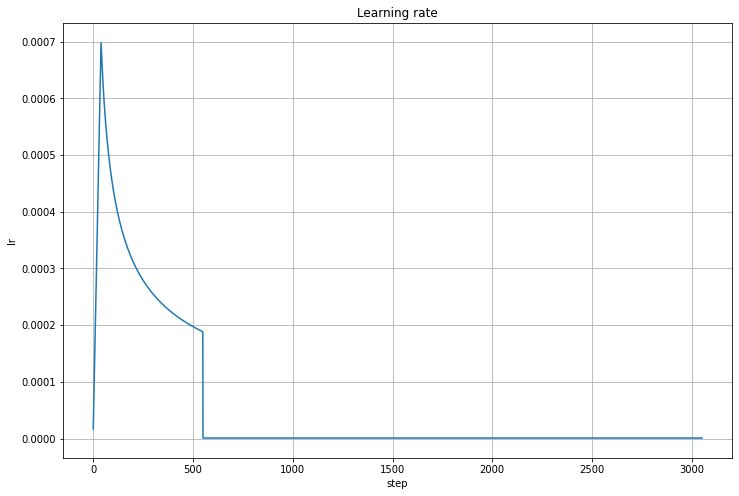
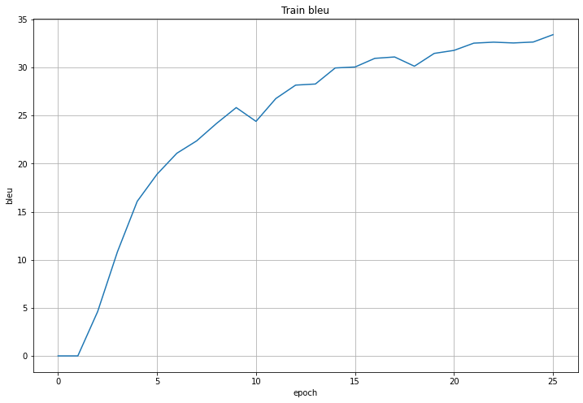
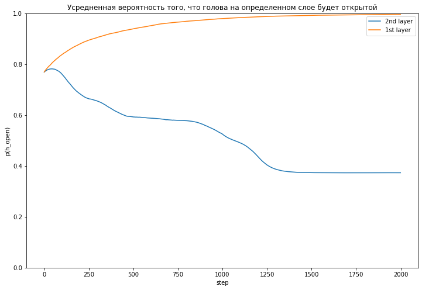
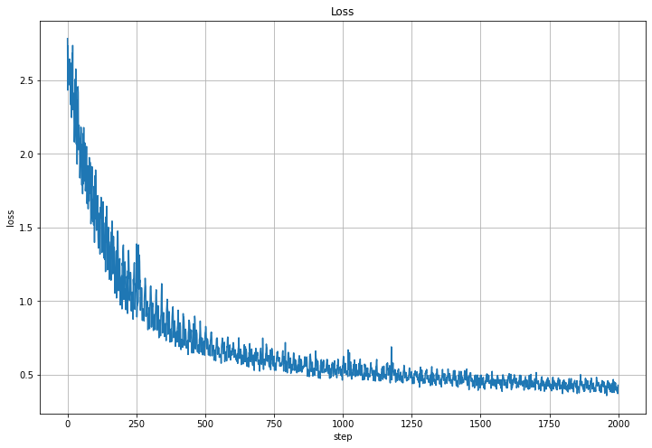
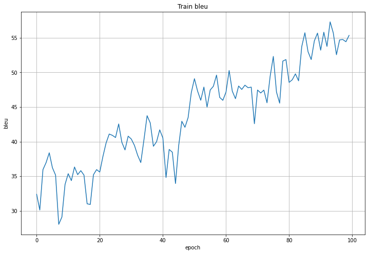
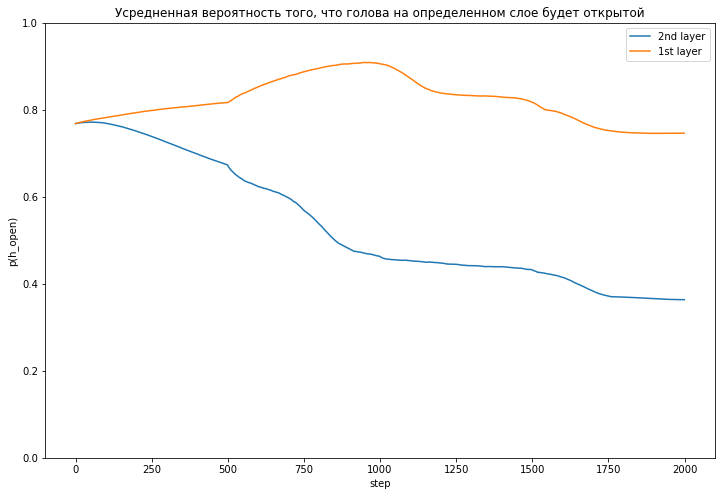
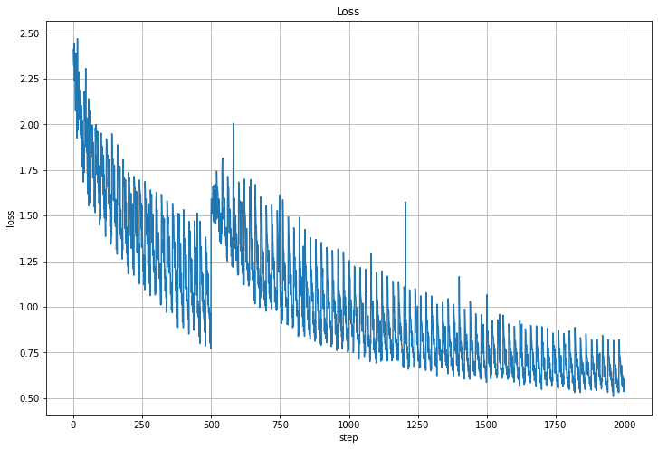
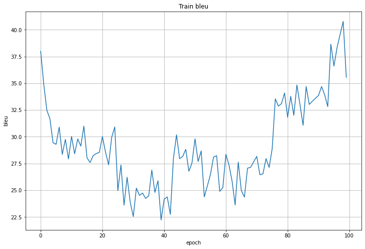

# Что это за проект?

Финальный проект [DLSchool](https://www.dlschool.org/).

### Про что проект
Применение модели Трансформер для решения задачи машинного перевода
Исследование методов уменьшения моделей, прунинг голов.

### Что делаем
Написать свой трансформер для решения задачи перевода, лучше разобраться в основных моментах реализации.
Разобраться с методами прунинга нейросетей; посмотреть, как работает для простых моделей и как работает удаление ""голов"" трансфрмера. Написать свой метод прунинга.

### План
1. Сделать модель трансформер и обучить её на задачу перевода.
2. Изучить тему прунинга нейронов и голов
3. Реализовать метод из статьи Voita et al."

---

## С какими трудностями столкнулся

* было не понятно, как при генерации src_seq_len может быть больше, чем последовательность, которую мы генерим.
В итоге тот факт, что при предсказании у меня не сходились размерности, я не сразу, но понял, что у меня была
ошибка в Attention'е... И прописывание размерностей для всех тензоров очень помогает.


## Что помогло:

* тесты -- так намного быстрее можно управиться с багами в размерностях или архитектуре, чем если тестить и разрабатывать в ноутбуках
* http://nlp.seas.harvard.edu/2018/04/03/attention.html (из доки hf-transformers)
* https://lena-voita.github.io/nlp_course/seq2seq_and_attention.html
* https://lena-voita.github.io/posts/acl19_heads.html
* https://lena-voita.github.io/posts/source_target_contributions_to_nmt.html было просто интересно!
* статья про оптимизацию L0 лоссов https://openreview.net/pdf?id=H1Y8hhg0b

# Структура проекта

| Директория | Описание |
|--|---|
| models| модельки, логика, архитектура |
|datamodules| дата-модули, работа с датасетом |
|pl_transformer.py| Скрипт для обучения трансформера |
|pl_pruned_enconder_transformer.py| Скрипт для прунинга обученного трансформера |


todo

version_12 -- нормально обученная модель, batch_size 50

4_blocks_512_bs_100_3epochs 4_blocks_512_bs_100_10epochs -- это пожирнее трансформер, bs = 100

# MVP

## (Пере)Обучение трансформера

Обучался на WMT16 en-ru. Переводил с английского на русский.

Для начала надо убедиться, что этим кодом можно вообще хоть что-нибудь обучить.

Поэтому я начал с маленькой модели:
* 2 блока и у энкодера, и у декодера
* d_model = 512
* {k,q,v}_dim = 64
* src_vocab_size = trg_vocab_size = 10000

И попробовал переобучить ее на небольшом кол-ве данных (100 батчей, batch_size=100).
Блеу считал на тех же данных (да, так нельзя, но для мвп можно), просто хотелось на трейне мерить
метрики в конце эпохи.



Сначала использовал noam scheduler (warmup_steps=4000, но тк я хотел ускорить уменьшение lr, [noam_step_factor](https://github.com/mrsndmn/dls-nmt-project/blob/5425c5d447ccf93eecee33ccfff51e4b5881a8af/pl_transformer.py#L153) выставил равным 4).



Но после примерно первых 6 эпох убрал шедулер и учил с постоянным lr=1e-6. Сейчас не могу объяснить, почему это сделал, но это сработало -- она обучилась, хотя сейчас кажется, что лучше бы оставил noam. Возможно, у меня не получилось тогда
сделать resume_from_checkpoint -- в lightning'e эта фича через раз работает и никаких логов не пишет, чтобы можно было разобраться в чем проблема, поэтому пришлось так костылить.

Одна эпоха обучалась в колабе 15 минут. Всего обучалась такая сетка 26 эпох. И на последней эпохе достигла `bleu = 33`. Измерял на тех же 100 батчах, что и трейнился.



Вот примеры переводов:
* [нулевая эпоха](resources/2blocks/0epoch_translation.txt)
* [вторая](resources/2blocks/2epoch_translation.txt)
* [пятнадцатая](resources/2blocks/15epoch_translation.txt)
* [последняя](resources/2blocks/26epoch_translation.txt)
* [target](resources/2blocks/target_translation.txt)

Тут было интересно наблюдать за тем, куда действительно обращает внимание трансформер:
на начальных эпохах (хотя и в конце тоже) он может зацикливаться или сбивать внимание
больше на то, что он сам сгенерил, а не на source seq.

На этом я решил остановиться с переобучением трансформеров и перейти к прунингу.

## Прунинг голов энкодера

Сначала не хотелось верить, что невозможно обучить сразу маленькое кол-во голов так, чтобы они были по качеству примерно такие же, как "запруненая" модель. Но после того, как реализовал и начал обучать сам, стало понятно, что мы не "просто отрубаем ненужные головы", а во время занижения веса/важности ненужных голов, нужные, умные головы тоже обучаются так, что берут на себя те функции, которые раньше исполняли запруненные головы.

В экспериментах тоже исползовал только часть данных.
* lr = 0.0005

Провел 2 эксперимента:

По горизонтали головы (8 штук), по вертикали слои (2 штуки) (это был трансформер с 2 слоями, потому что его было проще обучить)

Для этого эксперимента я выставил меньше `batch_size`, чтобы быстрее вычислялся один шаг. Но `valid_batch_size` и `limit_val_batches` подбирал так, чтобы общее количество предложений, по которым считался `bleu` было 500.


### hcg_l0_penalty_lambda=0.05

Тут все похоже на то, что получила Viota. Тоже больше голов прунится на первом слое.
И спрунилось меньше голов чем в случае lambda 0.1.




Визуализация того, как прунились головы:


> По горизонтали головы (8 штук), по вертикали слои (2 штуки)

> ЗЫ почему из lightning_logs не все картинки удалось заэкспортить (из-за этого довольно большой скачок в цветах виден в начале гифки) пока не разобрался, но кажется, что это особенности логгера, типа так он пытается меньше места логами занимать -- удаляет картинки старые..

Действительно, в конце обучения все головы или полностью спрунились, или полностью остались.

Лосс, как и следовало ожидать, уменьшается.


Блеу, видно, что даже увеличивается. Но думаю, что это больше связано с тем, что данных меньше, чем на обучении.
И сеть начала на них просто переобучаться. Для `lammbda=0.1` было видно, что блеу уменьшился, когда срезали большее количество голов.



### hcg_l0_penalty_lambda=0.1



Как прунились головы:


> По горизонтали головы (8 штук), по вертикали слои (2 штуки)


Лосс такой разный, потому что похоже, что на нескольких запусках менялся batch_size или, возможно, даже learning_rate.
Я понимаю, что это плохо и в больших и важных экспериментах так нельзя. Но пока что не видел какого-то инструмента,
в котором бы можно было как-то нормально версионировать модели и логировать какую-то мету о модели, о том, как менялись
гиперпараметры. Можно, наверное, все гиперпараметры писать в тензорборд, но это как-то не очень круто, наверное..

Видно, что сначала дисперсия лосса росла. Потом когда я что-то поменял, она перестала расти и модель начала сходиться и лучше обучаться.


Тут блеу сначала уменьшался, потому что видимо, лямбда вносила довольно большой вклад в результирующий лосс, а потом видно, как оставшиеся головы смогли взять на себя функции, которые раньше выполняли запруненные головы.



# todo повторить на большом трансформере!

---

# Appendix

## из идей, которые появились, пока этим занимался:
* можно ли для того, чтобы обучить большой трансформер, обучить сначала маленький, а потом
скопировать уже обученные слои? Поможет ли это ускорить решение? Из того, как слои прунятся, точно понятно,
что первый слой не надо копировать, он особенный и полезная голова там обычно только одна)).
* можно ли ускорить обучение трансформера, если сначала переобучить его на маленьком датасете, а
потом дообучить на большом. Потому что хотя мой трансформер был точно переобучен на маленькой части датасета,
он довольно неплохо справлялся с переводами, которые я сам в него загонял интерактивно в ноутбуке

## Команды, которыми можно запустить обучение/прунинг

Обученные веса двухблочного трансформера [тут](https://drive.google.com/drive/folders/10Sp-fjyNLp9IGlaGcdt-iWn3z0X_sR8e?usp=sharing).

### Обученние + скачка данных, если их еще нет в `.data`. Если нужно будет поменять trg_vocab_size/src_vocab_size, то надо сначала удалить старые даныне, чтобы пересчитать bpe.
```
!PYTHONPATH=. python3 pl_transformer.py --check_val_every_n_epoch 1 \
                                        --limit_val_batches=100 \
                                        --max_epochs 5 \
                                        --batch_size=100 \
                                        --val_batch_size=20 \
                                        --src_vocab_size=10000 \
                                        --trg_vocab_size=10000 \
                                        --scheduler=noam \
                                        --noam_step_factor=2 \
                                        --noam_opt_warmup_steps=4000 \
                                        --scheduler_patience=10 \
                                        --lr=1 \
                                        --num_blocks 6 \
                                        --hidden_dim 512 \
                                        --key_query_value_dim=64 \
                                        --gpus=1 \
                                        --progress_bar_refresh_rate=20
```
ЗЫ lr=1 тут потому что настоящий lr считается в шедулере и значение которое получили в шедулере умножается на значение, которое мы передали в lr.

### Прунинг
```
PYTHONPATH=. ~/anaconda3/bin/python pl_pruned_enconder_transformer.py \
    --checkpoint 'lightning_logs/version_12/checkpoints/epoch=24-step=128899.ckpt' \
    --encoder_with_hard_concrete_gate=1 \
    --strict='' \
    --lr=0.0005 \
    --gpus=1  \
    --scheduler=no \
    --noam_opt_warmup_steps=4000 \
    --noam_step_factor=2 \
    --batch_size=20 \
    --check_val_every_n_epoch=1 \
    --max_epochs=50 \
    --val_batch_size=20 \
    --src_vocab_size=10000 \
    --trg_vocab_size=10000 \
    --limit_val_batches=25 \
    --limit_train_batches=1000 \
    --hcg_l0_penalty_lambda=0.05
```

ЗЫ некоторые параметры, кажется довольно бессмысленно передавать, но из-за того, что в скриптах довольно криво парсятся аргументы и интерфейс модудей, их приходится передавать (но на будущее я понял, что лучше не делать позиционных аргументах в лайтинг моделях)
