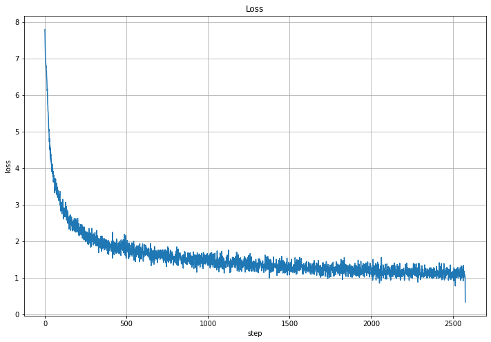
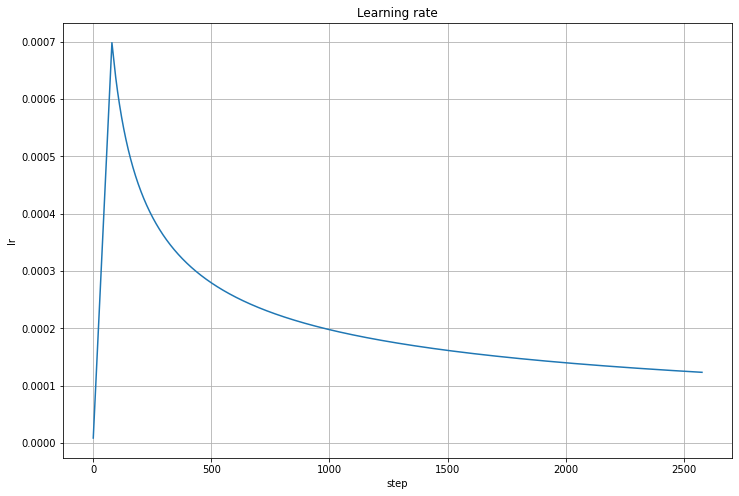

## Обучение

Фиксы после mvp версии:
* валидацию делаем на действительно отложенном датасете, а не на трейне
* рандомная сортировка предложений. В первой версии они были отсортированы по длинне. Поэтому у лосса были периоды.


Во время обучения `batch_size = 50`






## Примеры перевода

```
translation:

этот провал уже вызвал многие коренные проблемы.

это значительно повысило бы устойчивость долга этих стран.

популярность исламистов не трудно понять.

нью-йорк – я – американский, московский корпус.

среди нелояльности, однако, каждый из них становится преданным по-своему.


=======
target:

такие неудачи пугают многих корейцев.

это позволит значительно повысить устойчивость долга этих стран.

популярность исламистов понять несложно.

нью-йорк – я американка, родилась в москве.

а вот предателем каждый становится по-своему.
```

## Прунинг голов энкодера


### lambda=0.2


> Тут в легенде перепутаны первый и второй слои


> По горизонтали головы (8 штук), по вертикали слои (2 штуки)

### lambda=0.1


> Тут в легенде перепутаны первый и второй слои


> По горизонтали головы (8 штук), по вертикали слои (2 штуки)

### lambda=0.05


> Тут в легенде перепутаны первый и второй слои


> По горизонтали головы (8 штук), по вертикали слои (2 штуки)

