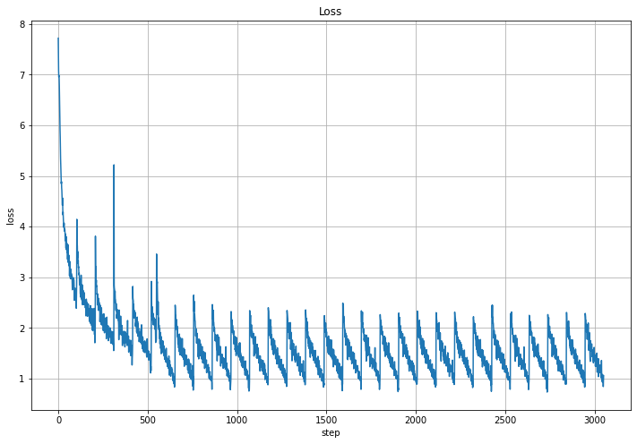
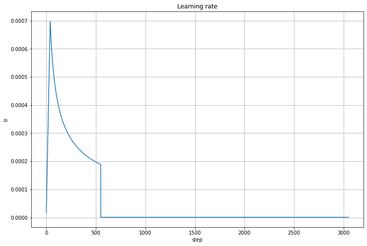
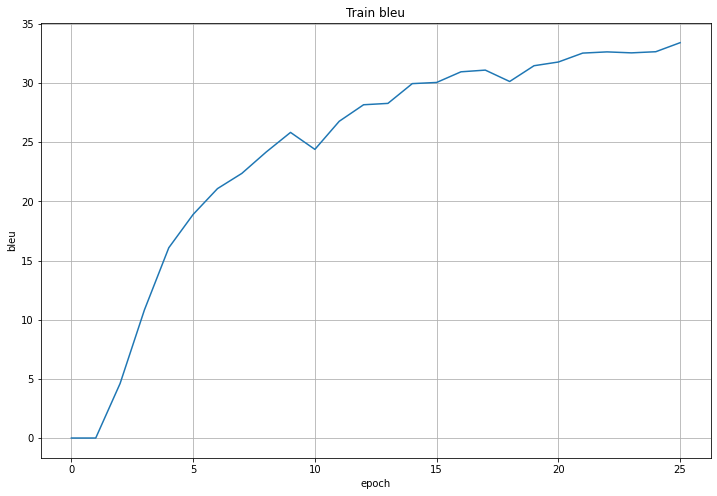
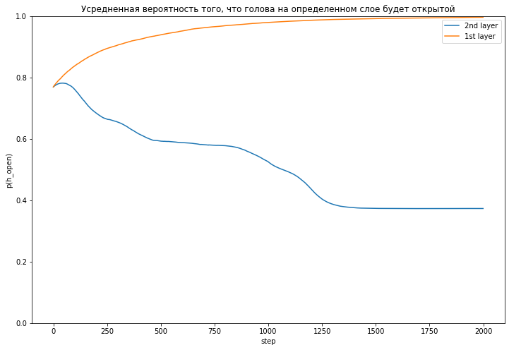
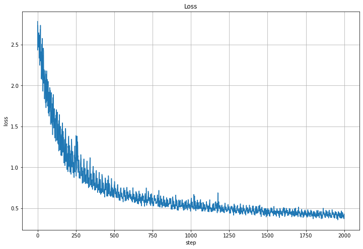
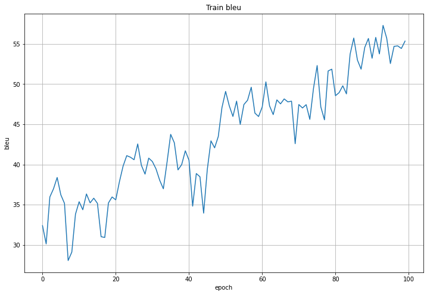
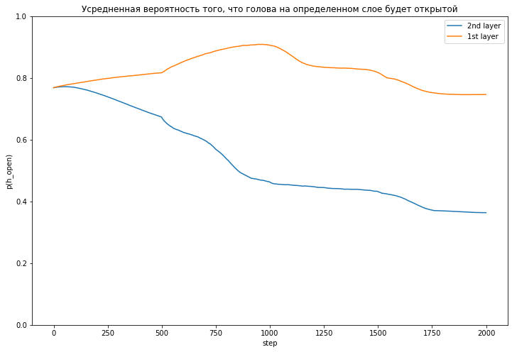
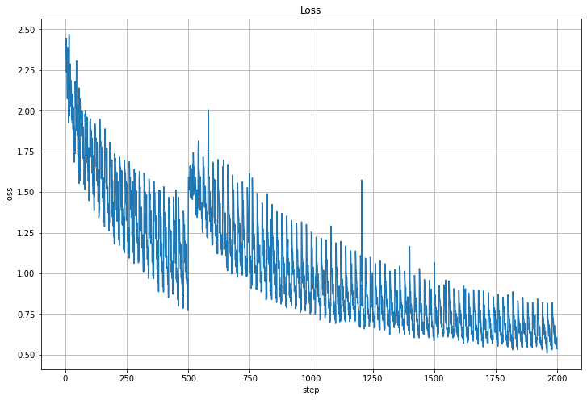
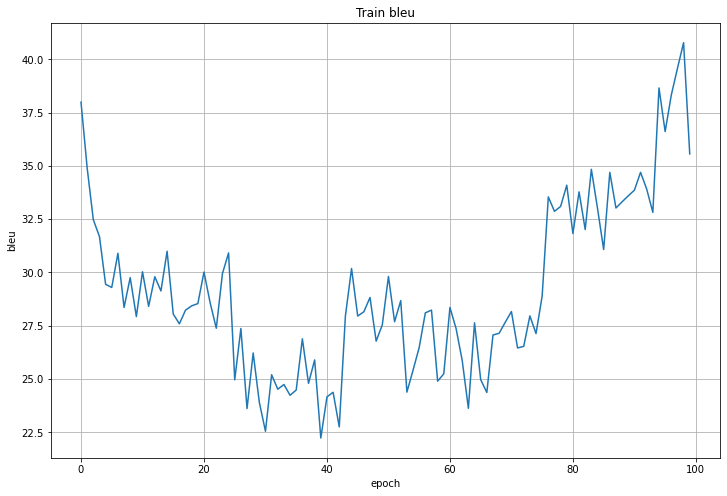

# MVP

## Обучение

Для начала надо убедиться, что этим кодом можно вообще хоть что-нибудь обучить.

Поэтому я попробовал переобучить ее на небольшом кол-ве данных (100 батчей, batch_size=100).
Блеу считал на тех же данных (да, так нельзя, но для мвп можно), просто хотелось на трейне мерить
метрики в конце эпохи.

Сначала использовал noam scheduler (warmup_steps=4000, но тк я хотел ускорить уменьшение lr, [noam_step_factor](https://github.com/mrsndmn/dls-nmt-project/blob/5425c5d447ccf93eecee33ccfff51e4b5881a8af/pl_transformer.py#L153) выставил равным 4).

Но после примерно первых 6 эпох убрал шедулер и учил с постоянным lr=1e-6. Сейчас не могу объяснить, почему это сделал, но это сработало -- она обучилась, хотя сейчас кажется, что лучше бы оставил noam. Возможно, у меня не получилось тогда
сделать resume_from_checkpoint -- в lightning'e эта фича через раз работает и никаких логов не пишет, чтобы можно было разобраться в чем проблема, поэтому пришлось так костылить.

Одна эпоха обучалась в колабе 15 минут. Всего обучалась такая сетка 26 эпох. И на последней эпохе достигла `bleu = 33`. Измерял на тех же 100 батчах, что и трейнился.

Вот примеры переводов:
* [нулевая эпоха](resources/2blocks/0epoch_translation.txt)
* [вторая](resources/2blocks/2epoch_translation.txt)
* [пятнадцатая](resources/2blocks/15epoch_translation.txt)
* [последняя](resources/2blocks/26epoch_translation.txt)
* [target](resources/2blocks/target_translation.txt)

Тут было интересно наблюдать за тем, куда действительно обращает внимание трансформер:
на начальных эпохах (хотя и в конце тоже) он может зацикливаться или сбивать внимание
больше на то, что он сам сгенерил, а не на source seq.

На этом я решил остановиться с переобучением трансформеров и перейти к прунингу.

## Прунинг голов энкодера

Сначала не хотелось верить, что невозможно обучить сразу маленькое кол-во голов так, чтобы они были по качеству примерно такие же, как "запруненая" модель. Но после того, как реализовал и начал обучать сам, стало понятно, что мы не "просто отрубаем ненужные головы", а во время занижения веса/важности ненужных голов, нужные, умные головы тоже обучаются так, что берут на себя те функции, которые раньше исполняли запруненные головы.

В экспериментах тоже исползовал только часть данных.
* lr = 0.0005

Провел 2 эксперимента:

По горизонтали головы (8 штук), по вертикали слои (2 штуки) (это был трансформер с 2 слоями, потому что его было проще обучить)

Для этого эксперимента я выставил меньше `batch_size`, чтобы быстрее вычислялся один шаг. Но `valid_batch_size` и `limit_val_batches` подбирал так, чтобы общее количество предложений, по которым считался `bleu` было 500.

### hcg_l0_penalty_lambda=0.05

Тут все похоже на то, что получила Viota. Тоже больше голов прунится на первом слое.
И спрунилось меньше голов чем в случае lambda 0.1.

Визуализация того, как прунились головы:

> По горизонтали головы (8 штук), по вертикали слои (2 штуки)

> ЗЫ почему из lightning_logs не все картинки удалось заэкспортить (из-за этого довольно большой скачок в цветах виден в начале гифки) пока не разобрался, но кажется, что это особенности логгера, типа так он пытается меньше места логами занимать -- удаляет картинки старые..

Действительно, в конце обучения все головы или полностью спрунились, или полностью остались.

Лосс, как и следовало ожидать, уменьшается.

Блеу, видно, что даже увеличивается. Но думаю, что это больше связано с тем, что данных меньше, чем на обучении.
И сеть начала на них просто переобучаться. Для `lammbda=0.1` было видно, что блеу уменьшился, когда срезали большее количество голов.

### hcg_l0_penalty_lambda=0.1

Как прунились головы:

> По горизонтали головы (8 штук), по вертикали слои (2 штуки)

Лосс такой разный, потому что похоже, что на нескольких запусках менялся batch_size или, возможно, даже learning_rate.
Я понимаю, что это плохо и в больших и важных экспериментах так нельзя. Но пока что не видел какого-то инструмента,
в котором бы можно было как-то нормально версионировать модели и логировать какую-то мету о модели, о том, как менялись
гиперпараметры. Можно, наверное, все гиперпараметры писать в тензорборд, но это как-то не очень круто, наверное..

Видно, что сначала дисперсия лосса росла. Потом когда я что-то поменял, она перестала расти и модель начала сходиться и лучше обучаться.

Тут блеу сначала уменьшался, потому что видимо, лямбда вносила довольно большой вклад в результирующий лосс, а потом видно, как оставшиеся головы смогли взять на себя функции, которые раньше выполняли запруненные головы.

### Веса

Обученные веса двухблочного трансформера [тут](https://drive.google.com/drive/folders/10Sp-fjyNLp9IGlaGcdt-iWn3z0X_sR8e?usp=sharing).
