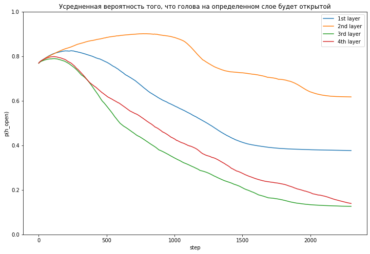

Хотелось поэксперементировать с большим количеством голов и блоков.

Попытки обучить трансформер из 6 блоков не увенчались успехом, но я все равно еще попробую разобраться и сделать это.

## Обучение


Во время обучения `batch_size = 100`


## Примеры перевода

На последней эпохе:

```
translation:

более комплексный подход будет сосредоточен на укреплении украины в каждом отношении.

в обоих случаях уровень долга в конечном счете стал неустойчивым.

время не было бы хуже.

вы в толпе, когда вы слышите вашу имя.

esda сократила свой час на балканах.


=======

target:

более комплексный подход предполагает усиление украины по всем направлениям.

в обоих случаях уровни задолженности стали непосильными.

нельзя было выбрать худшего момента для проведения таких мер.

находясь в толпе людей, вы слышите свое имя.

епоб приобрела свой первый опыт на балканах.
```

## Прунинг голов энкодера

Во время прунинга `batch_size = 20`.

### lambda=0.5

Уже когда писал отчет понял, что не зафризил декодер.. Поэтому блеу растет


### lambda=0.1


### lambda=0.05





PS вот тут не хватило колаба, чтобы сошлись некоторые гейты, но общий смысл ясен


## Веса

[тык](https://drive.google.com/file/d/1-Lg0ZgpnNXvBFbcExR2vNycfN_-9FBym/view?usp=sharing)
